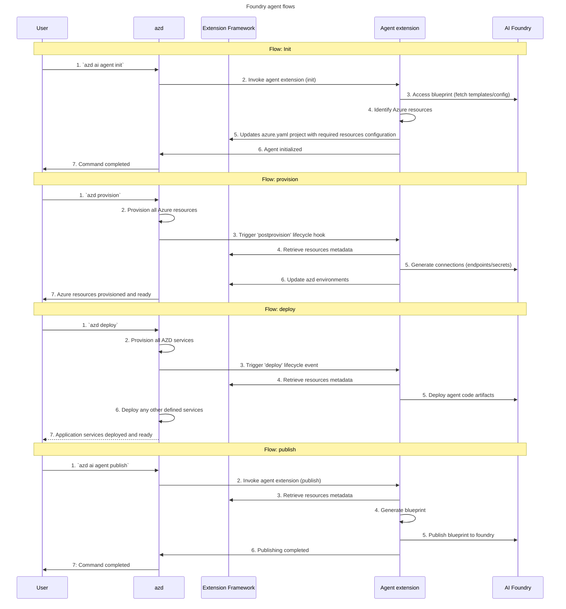

```mermaid
sequenceDiagram
    participant U as User
    participant AZD as azd
    participant XF as Extension Framework
    participant ext as Agent extension
    participant AIF as AI Foundry

    title Foundry agent flows

    %% ---------- Flow: init ----------
    Note over U,AIF: Flow: Init
    U->>AZD: 1. `azd ai agent init`
    AZD->>ext: 2. Invoke agent extension (init)
    ext->>AIF: 3. Access blueprint (fetch templates/config)
    ext->>ext: 4. Identify Azure resources
    ext->>XF: 5. Updates azure.yaml project with required resources configuration
    ext->>AZD: 6. Agent initialized
    AZD->>U: 7. Command completed

    %% ---------- Flow: provision ----------
    Note over U,AIF: Flow: provision
    U->>AZD: 1. `azd provision`
    AZD->>AZD: 2. Provision all Azure resources
    AZD->>ext: 3. Trigger 'postprovision' lifecycle hook
    ext->>XF: 4. Retrieve resources metadata
    ext->>AIF: 5. Generate connections (endpoints/secrets)
    ext->>XF: 6. Update azd environments
    AZD->>U: 7. Azure resources provisioned and ready

    %% ---------- Flow: deploy ----------
    Note over U,AIF: Flow: deploy
    U->>AZD: 1. `azd deploy`
    AZD->>AZD: 2. Provision all AZD services
    AZD->>ext: 3. Trigger 'deploy' lifecycle event
    ext->>XF: 4. Retrieve resources metadata
    ext->>AIF: 5. Deploy agent code artifacts
    AZD->>AZD: 6. Deploy any other defined services
    AZD-->>U: 7. Application services deployed and ready

    %% ---------- Flow: publish ----------
    Note over U,AIF: Flow: publish
    U->>AZD: 1. `azd ai agent publish`
    AZD->>ext: 2. Invoke agent extension (publish)
    ext->>XF: 3. Retrieve resources metadata
    ext->>ext: 4. Generate blueprint
    ext->>AIF: 5. Publish blueprint to foundry
    ext->>AZD: 6. Publishing completed
    AZD->>U: 7: Command completed
```